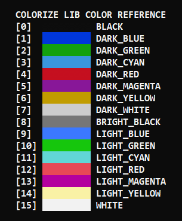

# ColorizeLIB

## Description
Colorize is a very very simple, but useful c library for windows. This lib basically allows you to colorize your terminal using a simple function colorize(backgroundColor, textColor).

## Color Reference
 <br/>

## Simpler Way
  The first version of colorize can be substituted for this command:
  ###### WITHOUT COLORIZE
  `SetConsoleTextAttribute(GetStdHandle(STD_OUTPUT_HANDLE), ( TEXT_COLOR + BACKGROUND_COLOR *16));`
  ###### WITH COLORIZE
  `colorize(BACKGROUND_COLOR,TEXT_COLOR)`
## Examples

 ```c
    colorize(0,4);
    printf("black background and dark red text");
    
    colorize(BLACK,4);
    printf("black background and dark red text");
    
    colorize(0,DARK_RED);
    printf("black background and dark red text");
    
    colorize(BLACK,DARK_RED);
    printf("black background and dark red text");
```
## Dependencies
  * windows.h 
